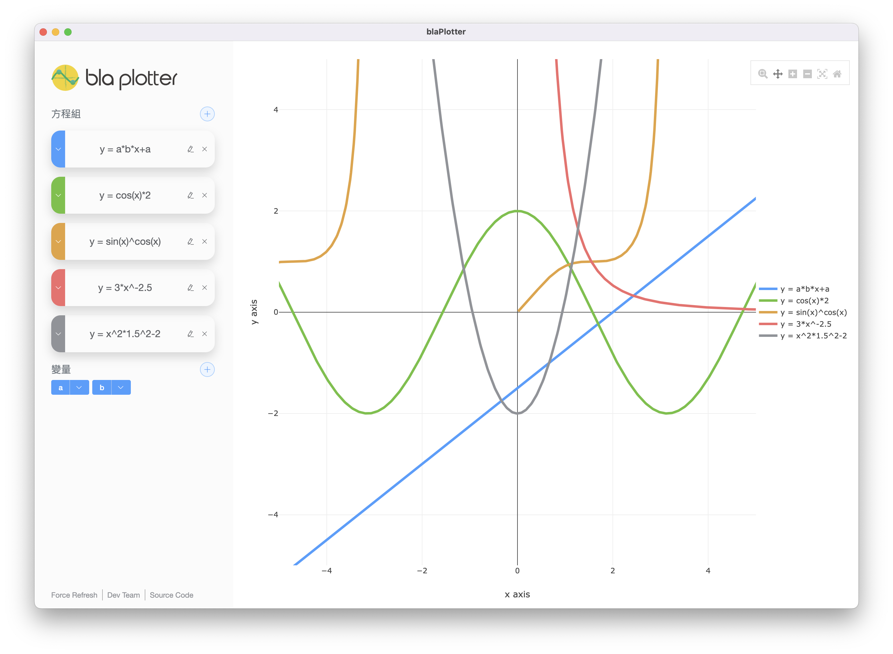

# <center>bla plotter<center>
### <center>高效能、垮平台的2D圖形繪製神器</center>

## Preview


## GUI
使用Electron + Vue3 + Pinia + TypeScript製作。如果您是使用macOS系統，且運作版本等於或高於macOS 10.13.6
您可以下載我們的release版本來執行，如果您想要自行編譯或是build，可以參照下面的語令(需要先安裝Git CLI)

### GUI運行與編譯(使用SourceCode運行)

#### Clone this Project
```shell
git clone https://github.com/Anzioh/equation_drawing.git
```

#### Check node version(only supported 14.4 ~ 16.15.1, You should install node.js first)
```shell
node -v
```

#### Install depends library
```shell
cd equation_drawing/GUI && npm install
```

#### fix es5-ext plugin path bug
```shell
npm run fix:es5-ext
```

#### run GUI
```shell
npm start
```

#### build app
```shell
npm run build
```

## API

### 新增方程式

addEquation {hash} {equation}

```json
{
    "id": 1, // 如果 isError 為 true 則回傳 -1
    "equation": "y=x+1",
    "isError": false,
    "errorMessage": "msg",
    "hash": "hash"
}
```

### 修改方程式

editEquation {hash} {id} {equation}

```json
{
    "id": 1,
    "srcEquation": "y=1",
    "equation": "y=x+1",
    "isError": false,
    "errorMessage": "msg",
    "hash": "hash"
}
```

### 取得方程式線上的座標

getLine {hash} {id} {dpi} {xMin} {xMax} {yMin} {yMax}

```json
{
    "x": [1, 2, 3, 4, 5],
    "y": [1, 2, 3, 4, 5],
    "hash": "hash"
}
```

### 取得所有方程式的線上的座標

getAllLine {hash} {dpi} {xMin} {xMax} {yMin} {yMax}

```json
{
    "equations": [
        {
            "id": 1,
            "x": [1, 2, 3, 4, 5],
            "y": [1, 2, 3, 4, 5]
        },
        {
            "id": 2,
            "x": [1, 2, 3, 4, 5],
            "y": [1, 2, 3, 4, 5]
        }
    ],
    "hash": "hash"
}
```

### 刪除方程式

delEquation {hash} {id}

```json
{
    "isError": false,
    "errorMessage": "",
    "hash": "hash"
}
```

### 新增變數

addVar {hash} {equation}

```json
{
    "id": 1,
    "isError": false,
    "equation": "a=1",
    "errorMessage": "",
    "hash": "hash"
}
```

### 編輯變數

editVar {hash} {id} {equation}

```json
{
    "id": 1,
    "srcEquation": "a=1",
    "equation": "a=1+2",
    "isError": false,
    "errorMessage": "",
    "hash": "hash"
}
```

### 刪除變數

delVar {hash} {id}

```json
{
    "isError": false,
    "errorMessage": "",
    "hash": "hash"
}
```

### API Factory(for GUI test)

apiTest {hash} {content}

```json
{
    "hash": "...",
    "content": "..."
}
```
